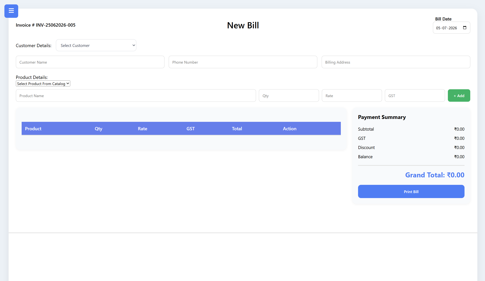
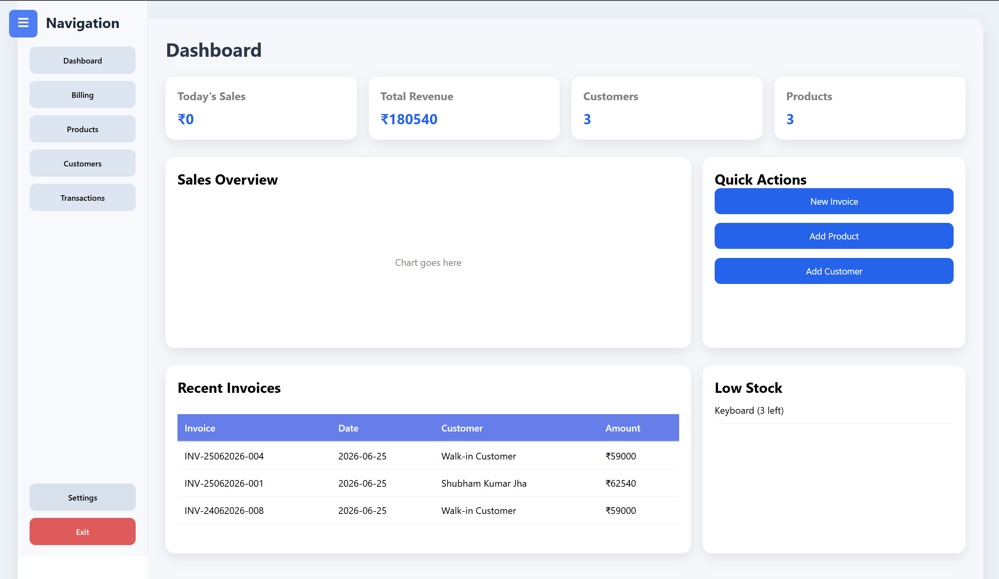

# Billing Software

A modern billing and invoice management application built with **React** and **Vite**. The application helps manage products, customers, generate invoices, and maintain inventory using browser local storage.

---

## Features

* 📦 Product Management

  * Add, edit, and delete products
  * Track product price, GST, and stock
  * Low stock monitoring

* 👥 Customer Management

  * Add, edit, and delete customers
  * Store customer details for invoicing

* 🧾 Invoice Generation

  * Create professional invoices
  * Automatic GST calculation
  * Grand total calculation
  * Invoice preview before printing

* 📊 Dashboard

  * Total products
  * Total customers
  * Today's sales
  * Total revenue
  * Recent invoices
  * Low stock products

* 💾 Local Storage

  * Data is automatically saved in the browser using Local Storage.
  * No backend or database is required.

* 🖨️ Print Support

  * Printable invoice layout
  * Clean invoice preview

---

## Tech Stack

* React
* Vite
* JavaScript (ES6+)
* HTML5
* CSS3
* React Router DOM

---

## Project Structure

```text
src/
│
├── components/
├── pages/
├── assets/
├── App.jsx
├── main.jsx
└── index.css

public/

package.json
vite.config.js
```

---

## Installation

Clone the repository:

```bash
git clone <repository-url>
```

Navigate to the project directory:

```bash
cd billing-software
```

Install dependencies:

```bash
npm install
```

Start the development server:

```bash
npm run dev
```

Open your browser and visit:

```text
http://localhost:5173
```

---

## Build for Production

```bash
npm run build
```

Preview the production build:

```bash
npm run preview
```

---

## Future Improvements

* Authentication and user accounts
* Database integration
* Cloud synchronization
* PDF invoice export
* Barcode support
* Product categories
* Sales reports and analytics
* Dark mode
* Backup and restore
* Role-based access

---

## Screenshots

#### Dashboard



#### Billing


---

---

## Author

Developed by **Shubham Jha**.
